# Results

- host hw: 4+4 CPUs (i7 6700), 16 GiB RAM
- host sw: linux 5.8.13-arch1-1, qemu 5.1.50
  ([c37a890d12e57a3d28c3c7ff50ba6b877f6fc2cc](https://gitlab.com/virtio-fs/qemu/-/tree/c37a890d12e57a3d28c3c7ff50ba6b877f6fc2cc))
- guest hw: 4 CPUs, 4 GiB RAM, 4 GiB DAX window
- guest sw:
  OSv [5372a230ce0abf0dc72e92ec1116208145e595c5](https://github.com/cloudius-systems/osv/tree/5372a230ce0abf0dc72e92ec1116208145e595c5)
- all data files and images on a tmpfs
- CPU affinity set to pin guest to 4 host CPUs and the rest (virtiofsd, perf, vegeta) to the
  remaining host CPUs
- CPU frequency scaling disabled (set the scaling governor to `performance`)
- perf to measure CPU utilization (using the `task-clock` event)
- memory usage through psutil's [`uss`](https://psutil.readthedocs.io/en/latest/#psutil.Process.memory_full_info),
  polling every 100msec and keeping max
- running with 5 repetitions

## fio

- 1 thread
- 1 GiB single file
- 10 x 80-100MiB multiple files
- linux 5.8.0-rc4-33261-gfaa931f16f27
  ([faa931f16f27d37a1b688d6129cf70b801a81506](https://gitlab.com/virtio-fs/linux/-/tree/faa931f16f27d37a1b688d6129cf70b801a81506))
- on linux guest, clearing page cache between runs (`sync; echo 3 > /proc/sys/vm/drop_caches`)
- on linux guest, no reboot between runs
- no resource usage measurement for the linux guest

### Single file, serial

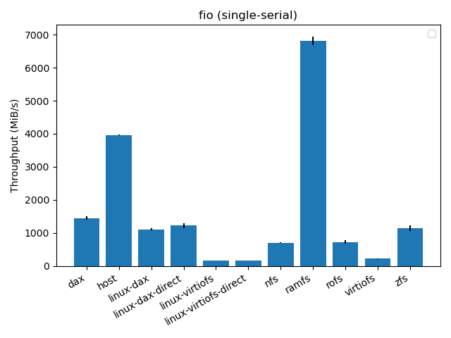
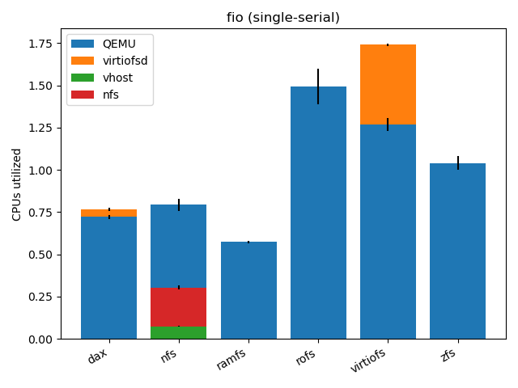
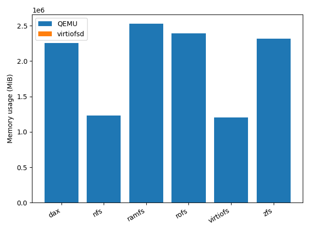

### Single file, random

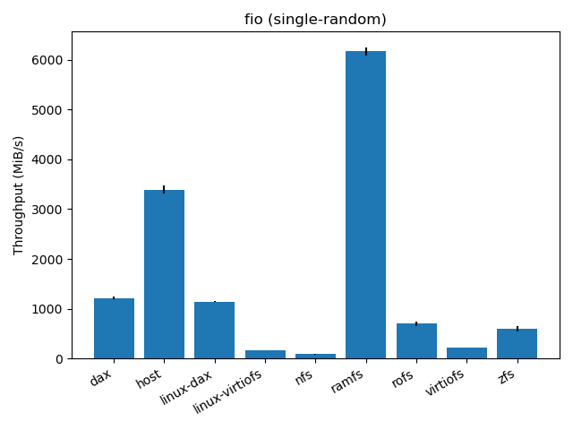

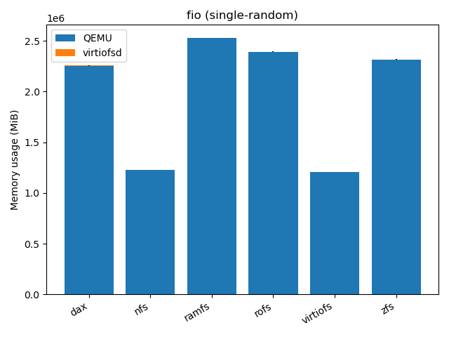

### Many files, serial

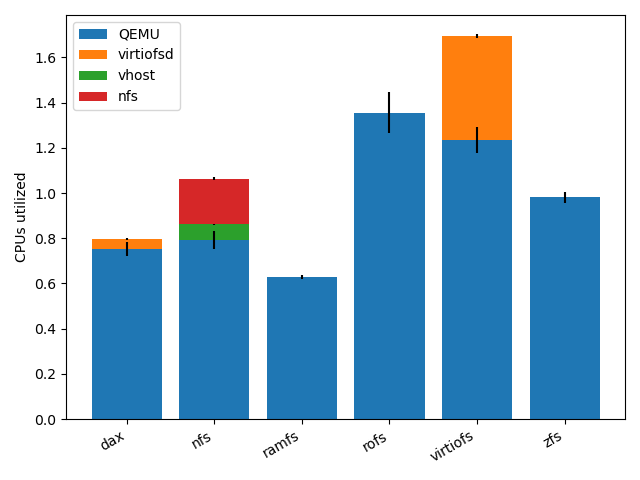
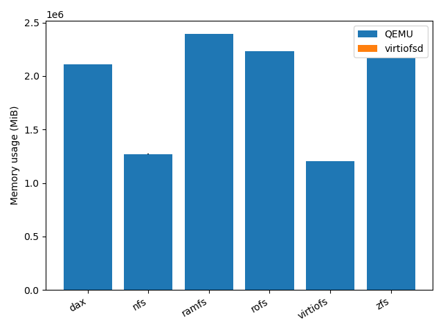

### Many files, random

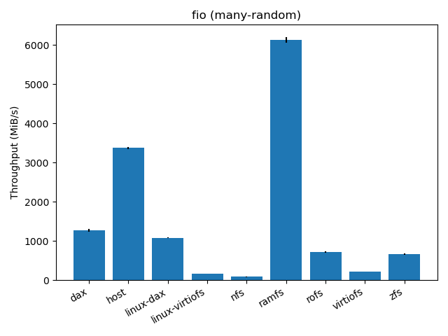
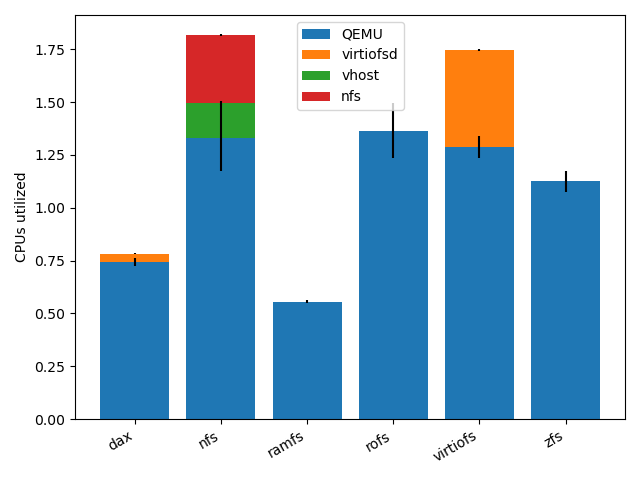

## App startup

- [spring-boot-example](https://github.com/foxeng/osv-apps/tree/virtiofs-tests/spring-boot-example)
- "boot" time is system boot, as [reported](https://github.com/cloudius-systems/osv/blob/5372a230ce0abf0dc72e92ec1116208145e595c5/loader.cc#L533)
  by OSv.
- "mount" time is the time to mount and pivot the root filesystem

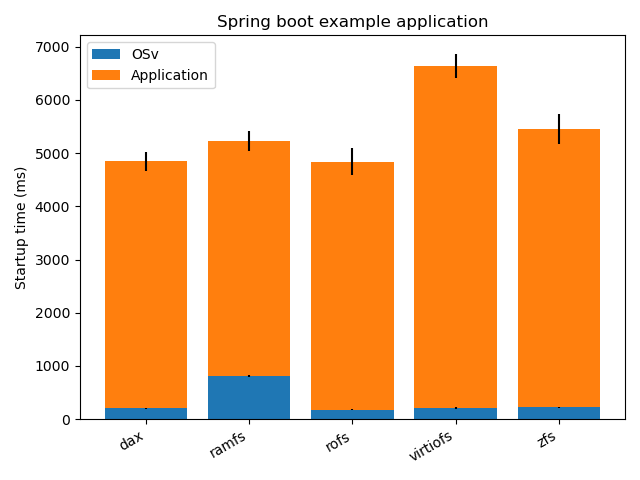
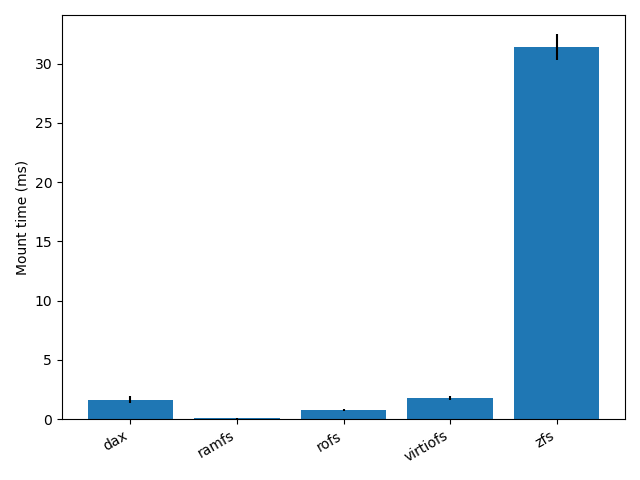

## nginx

- [nginx](https://github.com/foxeng/osv-apps/tree/virtiofs-tests/nginx): 10 static
  [files](https://github.com/foxeng/osv-apps/blob/7729a4425c38c035d001c6b00d23a7d6cdc0f3c2/nginx/Makefile#L28),
  max 16 MiB each
- [vegeta](https://github.com/foxeng/osv-apps/blob/virtiofs-tests/nginx/vegeta.sh) 12.8.3 on the
  host: 10 seconds, max qps (no rate limit), 4 CPUs, 20 workers

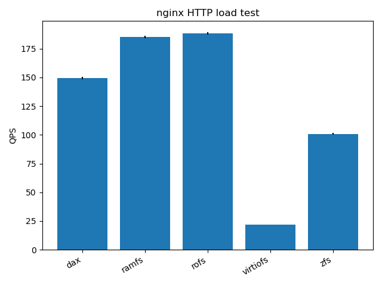
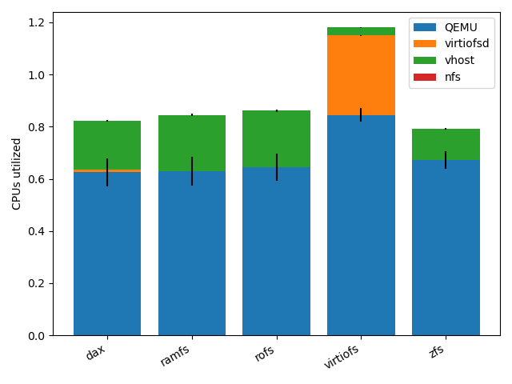
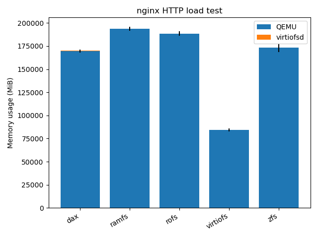
